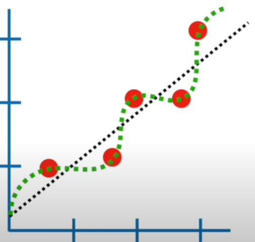
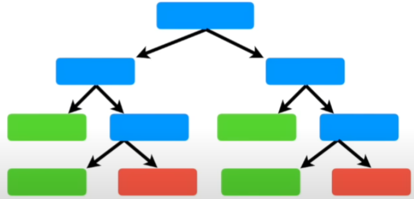

# Machine Learning Notes

## Regression: Line between data points

- Good for predicting
- Need to know what type of regression: Squiggly line vs Straight Line
- 

## Decision Trees: Graph with yes no branches

- Good for classification
- 
