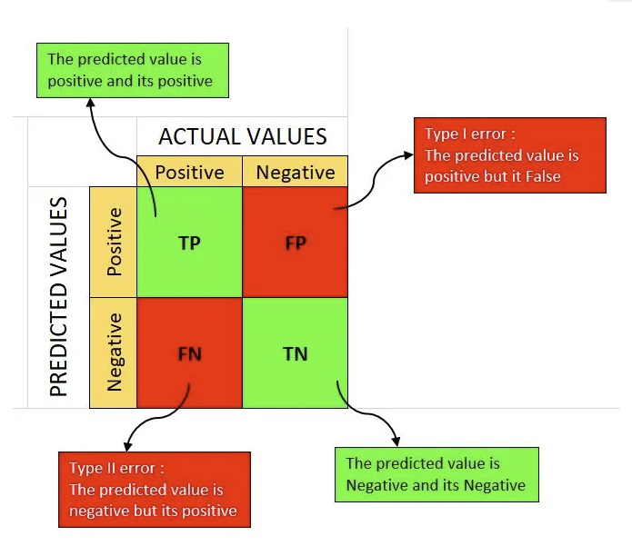

# Machine Learning Notes

## Regression: Line between data points

- Good for predicting
- Need to know what type of regression: Squiggly line vs Straight Line
- 

## Decision Trees: Graph with yes no branches

- Good for classification
- 

## Confusion Matrix

- Shows amount of True Positive/Negatives, False Negatives, and False Positives
- 

### Sensitivity

- True Positives/(True Positives + False Negatives)
- Percentage of data with something that were correctly identified

### Specificity

- True Negatives/(True Negatives + False Positives)
- Percentage of data without something that were correctly identified

## Bias
- Difference between prediciton 
## Variance